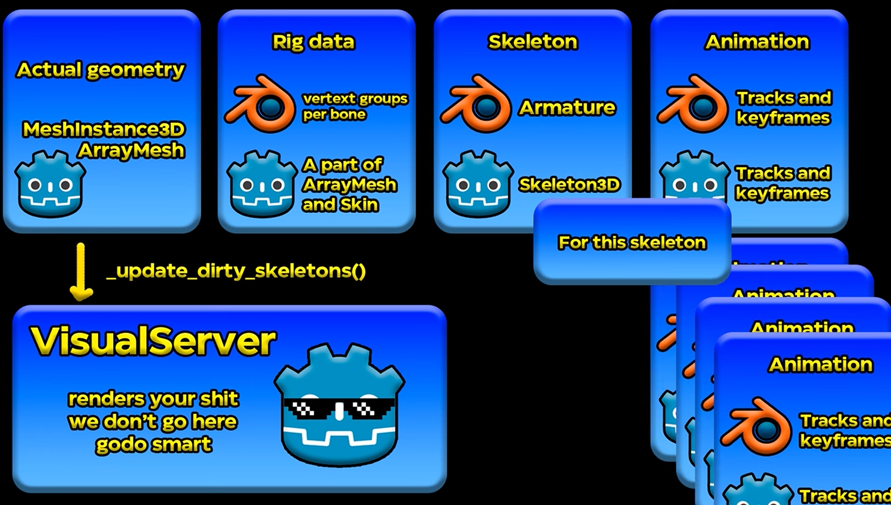

# 3D Animation (Blender) to Godot 

## Comprehensive intro:
https://www.youtube.com/watch?v=a0_JVEY7sbY

1. Godot 3D Animation Structure:

    - **Rig Data**: how much mesh point transform from a bone (weight: 0-1, usually support 4 bones per vertex)
2. `Import Script` exists 
    - modify the source-file-to-imported-scene _before_ the scene is saved in `.godot/imported`

### Misc
[Back to Main Page](../index.md)